This guide goes through all the steps to stream music from an analog vinyl player to your Sonos system, by using a Raspberry Pi.

The guide is based on this Instructable guide: https://www.instructables.com/Add-Aux-to-Sonos-Using-Raspberry-Pi/.


## Needed hardware
To stream the sound from a vinyl record player to the Sonos speakers, you will need:

* 1x RaspberryPi (with USB Type-A)
* 1x RaspberryPi power adapter (adjusted to the RaspberryPi you're using)
* 1x 8GB MicroSD card
* 1x SD card reader/adapter (if your computer doesn't already support it)
* 1x Behringer U-PHONE UFO202

## Overview software

### Darkice

DarkIce is a live audio streamer. It records audio from an audio interface (e.g. sound card), 
encodes it and sends it to a streaming server. This software is used to read the vinyl signals 
coming from the U-PHONE UFO202.

URL: [http://www.darkice.org](http://www.darkice.org)

### Icecast2

Icecast is a streaming media server which we will use to stream the live audio from Darkice and 
broadcast it out in our local network. This is what the Sonos speakers will pick up and play.

URL: [https://icecast.org](https://icecast.org)


## Guide of how to stream vinyl to your Sonos speakers

### Install Raspberry Pi Installer

The Raspberry Pi Installer is a software developed by the Raspberry Pi Foundation to simplify the installation of the Raspberry Pi OS to a microSD card.

Download the Raspberry Pi Installer on your computer by following the instructions on this website: [https://www.raspberrypi.com/software/](https://www.raspberrypi.com/software/)

After you've downloaded, installed and started the installer, you should see a page similar to this:

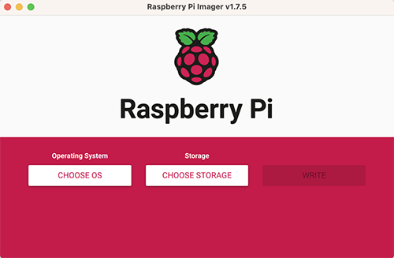


### Install Raspberry Pi OS

Start of by inserting the microSD card you're planing to use into the computer.

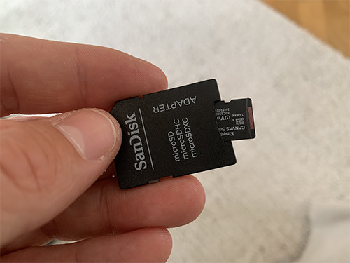

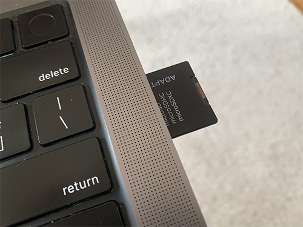

Then click on `CHOOSE OS` and choose `Raspberry Pi OS (32 bit)`. This will automatically download and install the latest release of the official Raspberry Pi OS to the microSD card.


After that, click on `CHOOSE STORAGE` and choose the microSD card you just inserted.

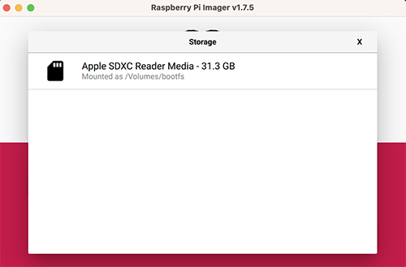

Before installing the OS, we want to change some configurations. This is done by clicking on the cogwheel in the lower right corner.


Do the following:

* Check `Set hostname` and change it to `vinyl.local`.
* Check `Enable SSH` and `Use password authentication`.
* Check `Set username and password` and choose whatever username and password you want to use to log into the Raspberry Pi.
* Check `Configure wireless LAN` and fill in the name of the wifi your Sonos speakers are connected to, as well as the wifi password.

Then click `SAVE`.

To install the OS to the microSD card, click `WRITE`. You might get prompted with a warning saying that all existing data will be erasted. If you're fine with this and want to proceed installing the OS, click `YES`.

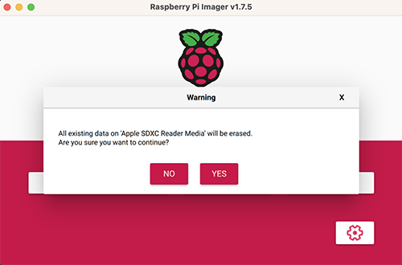

The installation should take approx. 5-10 minutes.

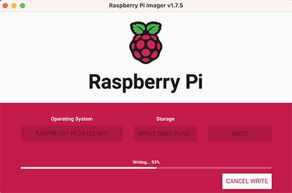

When the installation is done, remove the microSD card from your computer and insert it into the Raspberry Pi.


### Connect vinyl player to the Raspberry Pi

Start of by connecting the USB from Behringer U-PHONE UFO202 to the Raspberry Pi.


Then connect the red and white RCA cable from the vinyl player to the equivalent **input** on the Behringer U-PHONE UFO202. Red to input red, white to input white.

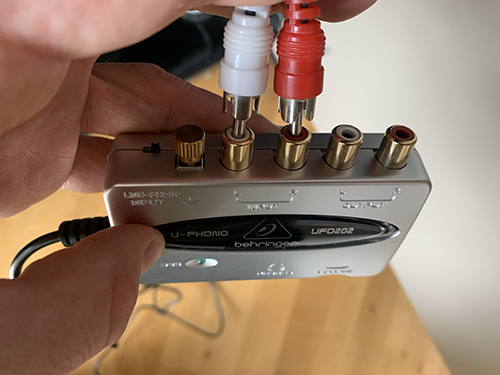

Finally, connect the power cable to the Raspberry Pi.

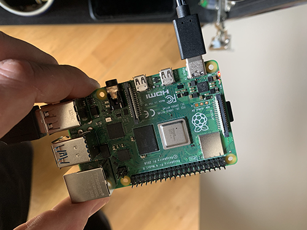

### Install software to stream audio

First, ssh into the Raspberry Pi

```bash
ssh <THE_USERNAME_YOU_PICKED>@vinyl.local
```

Clone down this repository

```bash
git clone git@github.com:maxvfischer/sonos_streaming.git
```

Go into the `sonos_streaming` folder

```bash
ls sonos_streaming
```

I've prepared a script installing docker. It's based on the documentation written by docker ([https://docs.docker.com/engine/install/debian/](https://docs.docker.com/engine/install/debian/)). You can either install docker by running the commands below, or go to the link and follow the instructions there.

```bash
sudo chmod +x install-docker.sh
sudo ./install-docker.sh
```

### Start the streaming service

To start the streaming service, run

```bash
sudo docker compose up -d
```

This will build and start the docker containers used to stream the signal from the vinyl to the sonos speakers.

### Point the Sonos speakers to the vinyl stream

Make sure that you have the Sonos app installer on your phone. It can be found in the App store. Also make sure that your Sonos system is properly set up and that you can control your speakers from your app.

Sorry about the language in the upcoming images. I wasn't able to change the language in my app from Swedish to English.

Open the Sonos app and click on the `Music` icon in the botton navigation bar. Then Click `Add a Service`, scroll down and click on `TuneIn` (not `TunIn (New)`, but the old one). Then follow the instructions to add `TunIn` to your app.

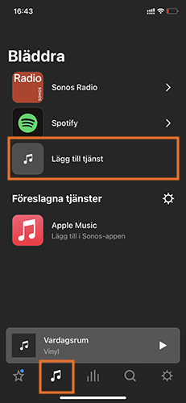

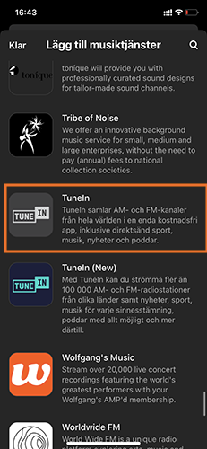


When added correctly, `TunIn` should show up under your Services. Click on it, then click on `My radio stations`

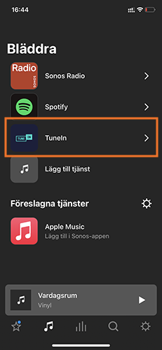


Click on the three dots in the top right corner, then on `Add a new radio station`.

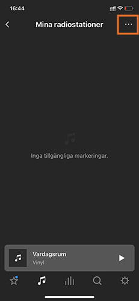

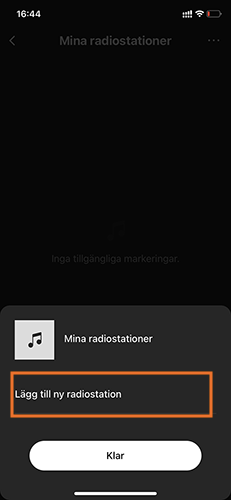

Fill in the following in the prompt:

* Streaming-URL: http://vinyl.local:8000/rapi.mp3
* Station name: Vinyl


Your vinal streaming station should now show up under `My radio stations`. You can now click on the `Vinyl` station, check the speakers you want to play the music from, put on a vinyl on your record player and enjoy.


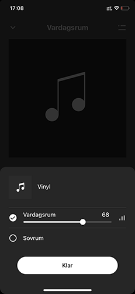


